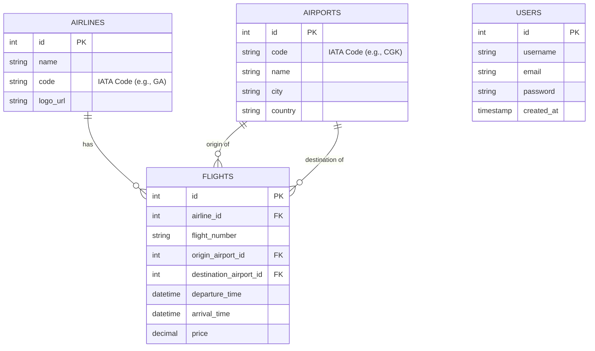

# Database Design (ER Diagram)

Berikut adalah desain database untuk aplikasi AviaTa. Diagram ini digenerate menggunakan syntax **Mermaid**.

Untuk melihat diagram ini secara visual di VS Code:
1. Buka file ini.
2. Tekan `Ctrl + Shift + V` (atau klik icon "Open Preview to the Side" di pojok kanan atas editor).

## Deskripsi Tabel

### 1. Airlines (Maskapai)
Menyimpan data maskapai penerbangan.
- `code`: Kode unik maskapai (contoh: GA untuk Garuda).

### 2. Airports (Bandara)
Menyimpan data bandara di seluruh dunia.
- `code`: Kode IATA bandara (contoh: CGK, SIN).

### 3. Flights (Penerbangan)
Tabel transaksi utama yang menyimpan jadwal penerbangan.
- Menghubungkan maskapai dengan bandara asal dan tujuan.
- Menyimpan harga dan waktu.

### 4. Users (Pengguna)
Menyimpan data akun pengguna aplikasi.
